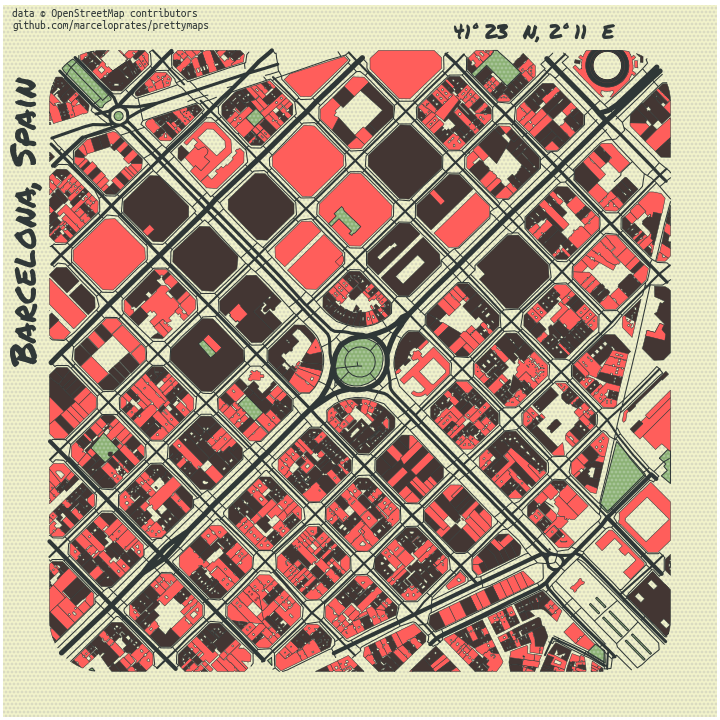

# prettymaps

A minimal Python library to draw customized maps from OpenStreetMap data.

Based on [osmnx](https://github.com/gboeing/osmnx), [matplotlib](https://matplotlib.org/), [shapely](https://shapely.readthedocs.io/en/stable/index.html) and [vsketch](https://github.com/abey79/vsketch) libraries.

## Google Colaboratory Demo

[](https://colab.research.google.com/github/marceloprates/prettymaps/blob/master/notebooks/examples.ipynb)

## Installation

Install with

```
$ pip install git+https://github.com/marceloprates/prettymaps.git
```

## Usage example (For more examples, see [this Jupyter Notebook](https://github.com/marceloprates/prettymaps/notebooks/examples.ipynb)):

```python
# Init matplotlib figure
fig, ax = plt.subplots(figsize = (12, 12), constrained_layout = True)

backup = plot(
    # Address:
    'Praça Ferreira do Amaral, Macau',
    # Plot geometries in a circle of radius:
    radius = 1100,
    # Matplotlib axis
    ax = ax,
    # Which OpenStreetMap layers to plot and their parameters:
    layers = {
            # Perimeter (in this case, a circle)
            'perimeter': {},
            # Streets and their widths
            'streets': {
                'width': {
                    'motorway': 5,
                    'trunk': 5,
                    'primary': 4.5,
                    'secondary': 4,
                    'tertiary': 3.5,
                    'residential': 3,
                    'service': 2,
                    'unclassified': 2,
                    'pedestrian': 2,
                    'footway': 1,
                }
            },
            # Other layers:
            #   Specify a name (for example, 'building') and which OpenStreetMap tags to fetch
            'building': {'tags': {'building': True, 'landuse': 'construction'}, 'union': False},
            'water': {'tags': {'natural': ['water', 'bay']}},
            'green': {'tags': {'landuse': 'grass', 'natural': ['island', 'wood'], 'leisure': 'park'}},
            'forest': {'tags': {'landuse': 'forest'}},
            'parking': {'tags': {'amenity': 'parking', 'highway': 'pedestrian', 'man_made': 'pier'}}
        },
        # drawing_kwargs:
        #   Reference a name previously defined in the 'layers' argument and specify matplotlib parameters to draw it
        drawing_kwargs = {
            'background': {'fc': '#F2F4CB', 'ec': '#dadbc1', 'hatch': 'ooo...', 'zorder': -1},
            'perimeter': {'fc': '#F2F4CB', 'ec': '#dadbc1', 'lw': 0, 'hatch': 'ooo...',  'zorder': 0},
            'green': {'fc': '#D0F1BF', 'ec': '#2F3737', 'lw': 1, 'zorder': 1},
            'forest': {'fc': '#64B96A', 'ec': '#2F3737', 'lw': 1, 'zorder': 1},
            'water': {'fc': '#a1e3ff', 'ec': '#2F3737', 'hatch': 'ooo...', 'hatch_c': '#85c9e6', 'lw': 1, 'zorder': 2},
            'parking': {'fc': '#F2F4CB', 'ec': '#2F3737', 'lw': 1, 'zorder': 3},
            'streets': {'fc': '#2F3737', 'ec': '#475657', 'alpha': 1, 'lw': 0, 'zorder': 3},
            'building': {'palette': ['#FFC857', '#E9724C', '#C5283D'], 'ec': '#2F3737', 'lw': .5, 'zorder': 4},
        }
)
```


## Gallery:

### Barcelona:

### Heerhugowaard:

### Barra da Tijuca:

### Porto Alegre:

